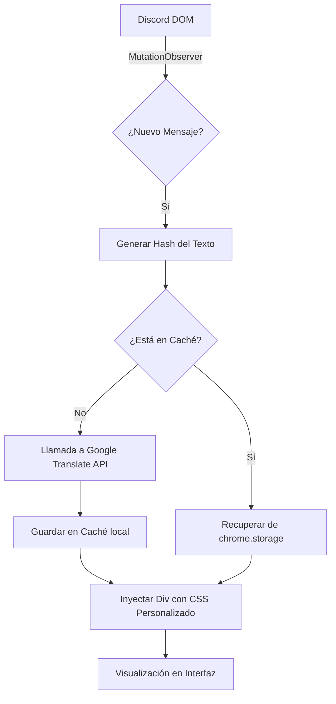

# 🌍 Discord Traductor

**Discord Traductor** es una extensión de navegador ligera y potente diseñada para romper las barreras lingüísticas en tiempo real. Permite traducir mensajes entrantes automáticamente y traducir tus propios mensajes salientes antes de enviarlos, todo manteniendo la estética original de Discord.

-----

## 🚀 Características Principales

  * **Traducción Entrante:** Traduce automáticamente los mensajes de otros usuarios.
  * **Traducción Saliente:** Escribe en tu idioma, presiona `Ctrl + Enter` y envía el texto traducido al instante.
  * **Caché Inteligente:** Almacena traducciones localmente para ahorrar cuota de API y mejorar la velocidad.
  * **Totalmente Configurable:** Panel de opciones para cambiar idiomas, prefijos de caché y estilos CSS.
  * **Privacidad:** Los datos se guardan en tu navegador (`chrome.storage.local`).

-----

## 🛠️ Instalación (Modo Desarrollador)

Como esta es una extensión personalizada, debes cargarla manualmente en tu navegador:

1.  **Descarga/Clona** este repositorio en una carpeta local.
2.  Abre tu navegador (Chrome, Edge o Brave) y ve a `chrome://extensions/`.
3.  Activa el **"Modo de desarrollador"** (interruptor en la esquina superior derecha).
4.  Haz clic en **"Cargar descomprimida"** (Load unpacked).
5.  Selecciona la carpeta donde guardaste los archivos del proyecto.
6.  ¡Listo\! Abre [Discord Web](https://www.google.com/search?q=https://discord.com/app) para empezar.

-----

## 📖 Modo de Uso

### 1\. Traducir Mensajes de Otros

La extensión detectará automáticamente los nuevos mensajes en los canales. Si el mensaje está en un idioma distinto al configurado, aparecerá una caja de texto estilizada justo debajo del mensaje original con la traducción.

### 2\. Traducir tus Mensajes (Escritura)

1.  Escribe tu mensaje en el cuadro de chat de Discord en tu idioma nativo.
2.  Presiona **`Ctrl + Enter`**.
3.  El texto será reemplazado automáticamente por la traducción antes de que presiones enviar.

### 3\. Configuración

Haz clic derecho en el icono de la extensión y selecciona **Opciones** para:

  * Cambiar el idioma de lectura (ej. de `en` a `es`).
  * Cambiar el idioma de escritura (ej. de `es` a `pt`).
  * Personalizar el diseño visual mediante CSS.
  * Limpiar la caché de traducciones para liberar espacio.

-----

## ⚙️ Funcionamiento Interno (Arquitectura)

El siguiente esquema describe el flujo de datos desde que llega un mensaje hasta que se visualiza la traducción:

### Esquema Lógico

### Componentes Clave:

1.  **MutationObserver:** Vigilante constante que detecta cambios en el HTML de Discord sin recargar la página.
2.  **Hashing (getTextHash):** Convierte frases largas en identificadores cortos (ej: `1a2b3c`) para organizar la base de datos de forma eficiente.
3.  **Service Layer:** Maneja las peticiones `fetch` asíncronas a la API de traducción de forma transparente.
4.  **Shadow DOM / Injection:** Inserta elementos de forma no intrusiva para no romper el funcionamiento del editor de texto de Discord (Slate.js).

-----

## ⚠️ Notas de Seguridad

  * **innerHTML vs textContent:** El código utiliza `textContent` para prevenir ataques de inyección (XSS) a través de traducciones maliciosas.
  * **Uso de API:** Esta extensión utiliza la API gratuita de Google Translate. Un uso extremadamente intensivo podría resultar en un bloqueo temporal de IP por parte de Google.

## 🔒 Privacidad y Seguridad

Este proyecto ha sido desarrollado bajo el principio de **Privacidad por Diseño**. A diferencia de otras extensiones de traducción comerciales, **Discord Translator Pro** no recolecta, vende ni rastrea tu actividad.

### 🛡️ ¿Cómo manejamos tus datos?

* **Almacenamiento Local:** Todas las traducciones y configuraciones se guardan exclusivamente en el almacenamiento local de tu navegador (`chrome.storage.local` *). Ningún tercero (excepto tú) tiene acceso a tu historial de traducción. 
  * *(**Beneficio:** Al usar `chrome.storage.local`, los datos **nunca salen de tu disco duro**, cumpliendo con un estándar de privacidad mucho más estricto.)
* **Conexión Directa:** El script se comunica directamente con la API de Google Translate desde tu navegador. No existe un servidor intermedio ("backend") que registre tus mensajes.
* **Sin Rastreadores:** No se utilizan cookies de seguimiento, Google Analytics ni scripts de terceros.
* **Código Transparente:** Al ser una extensión cargada en "Modo Desarrollador", puedes auditar cada línea de código para verificar que no se envía información a destinos desconocidos.

### ⚠️ Consideraciones sobre la API de Google
Al utilizar el servicio de `translate.googleapis.com`, los fragmentos de texto que deseas traducir son enviados a los servidores de Google para su procesamiento. Te recomendamos:
1.  **No traducir información sensible:** Evita usar la función de traducción en mensajes que contengan contraseñas, datos bancarios o información personal identificable.
2.  **Uso de HTTPS:** Todas las peticiones se realizan de forma cifrada mediante el protocolo TLS (HTTPS).

